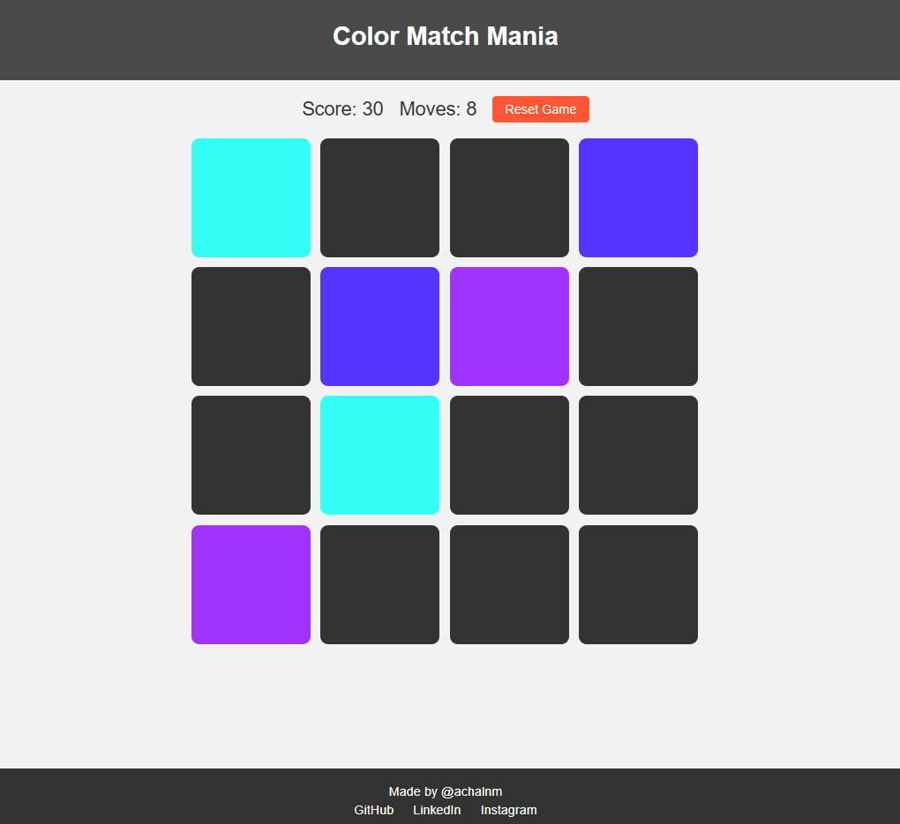

# Color Match Mania

I made this in my third year of BE Computer Science at Jyothy Institute of Technology (VTU). It was just a time pass thing while I was learning JavaScript and wanted to try making small browser games. Not a serious project at all, just something I did for fun.

## What it is

A 4x4 memory card game. There are 16 cards face down, each hiding one of 8 colors. You flip two at a time and try to find matching pairs. Match them and they stay up, you get 10 points, and there is a small confetti burst. No match and they flip back after a second. Find all 8 pairs and you win. There is also a move counter so you can see how many tries it took.

## How to run it

Just clone the repo or download it and open `index.html` in a browser. No setup needed.

    git clone https://github.com/achalnm/Color-Match-Mania-Memory-Card-Game.git

## Controls

Click to flip cards. Hit Reset Game to start over.

## Credits

Made by Achal N. [GitHub](https://github.com/achalnm) and [LinkedIn](https://www.linkedin.com/in/achal-n-35153821b/).
